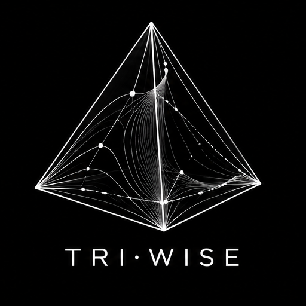
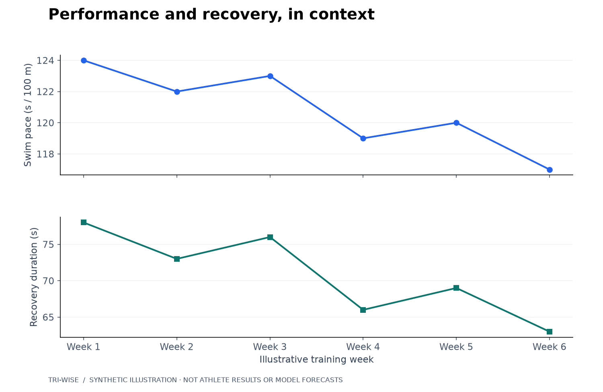
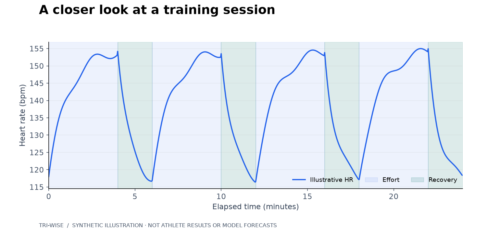
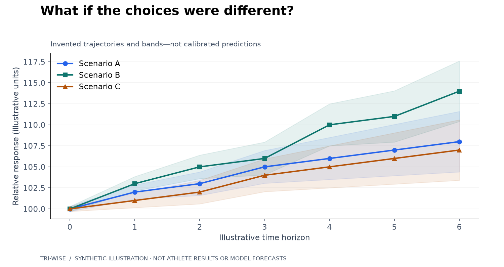

# Tri-wise

  

**Predictive analytics and what-if exploration for endurance performance.**

Tri-wise explores how training and race data, machine learning, and uncertainty-aware
decision models can support better-informed triathlon training and race strategy.

The project investigates four central questions:

- **What is changing?** Explore longitudinal patterns in training load,
  performance, and physiological response across swimming, cycling, and running.
- **How does training connect to racing?** Put preparation, race execution and
  age-group benchmarks in the context of a specific event and distance.
- **What might happen next?** Investigate ML-based predictions of training
  response and performance.
- **What if I made a different choice?** Explore alternative pacing, training,
  and recovery scenarios under explicit assumptions.

The technical direction combines Python-based analytics, interactive
visualizations, predictive modeling, and exploration of modern decision-modeling
approaches such as Laya.

**The underlying methodology and implementation are intentionally kept private.**
This repository provides a visual overview of the project's focus without
disclosing its internal methods or development status.

## From training to race day

A training improvement becomes more useful when we can ask where it shows up on
race day. Tri-wise explores that connection across swim, bike, transitions and run:

- **Race context:** distinguish sprint, Olympic and middle-distance events, and
  account for differences between courses and conditions.
- **Age-group perspective:** compare with actual competitors at the same event,
  keeping an overall performance goal connected to individual disciplines.
- **Bike-to-run execution:** explore how effort during the bike relates to the
  run that follows, alongside the athlete's preparation.
- **Personal context:** interpret observations with dated physiological references
  and awareness of the equipment used to record them.

The aim is to turn an observation into a focused question for the next training
block. A slower run after a hard ride is a starting point for investigation;
it does not, by itself, explain what caused the result. Comparisons need clear
sources, comparable timing definitions and visible uncertainty.

## A visual perspective

All figures below use invented values. They illustrate analytical questions,
not measured athlete outcomes, model forecasts, or validated training
recommendations. They are not screenshots of the private system.

### Patterns over time

Relate changes in performance to recovery rather than reading either in isolation.
This swimming illustration is one example within a broader swim, bike, and run focus.

*Synthetic illustration—not athlete results.*

### From the bigger picture to a session

Explore how effort and physiological response vary during a workout, placing
aggregate observations back in their session context.

*Synthetic illustration—not recorded sensor data.*

### Exploring alternatives

Compare possible trajectories under different choices, making uncertainty
visible rather than presenting a single outcome as inevitable.

*Synthetic concept illustration—not model forecasts. The bands are illustrative,
not calibrated confidence intervals.*

---

The showcase communicates the questions and perspective of the project.
It does not disclose algorithms, feature definitions, selection rules,
model configurations, or optimization procedures.
