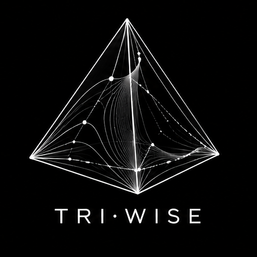
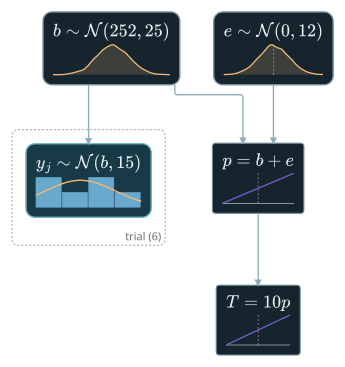

# tri-wise

  

**Connecting training evidence to race performance.**

tri-wise is an applied research project at the intersection of endurance sport,
probabilistic modeling, and decision support. It explores how longitudinal
training records and race results can help an athlete understand performance,
identify meaningful opportunities, and make better-informed training and pacing
choices.

The scope includes standalone running races and triathlon. A central prediction
question is: **what finish time is plausible, what is the probability of meeting
a target, and which evidence supports the forecast?**

Triathlon adds a demanding setting: three disciplines, interacting fatigue,
variable courses and conditions, and imperfect measurements. The central question
for causal investigation is: **which changes in preparation are likely to matter on race day,
and how strong is the evidence?**

## Explore the demo

[Open the interactive demo](https://tri-wise-model-explorer.woollyknoll64.chatgpt.site)
to explore how training evidence becomes a race prediction with uncertainty.
The agent examples compare finish-time targets and explore how changes in
preparation could affect an outcome.

The demo uses synthetic data and simulated agent interactions; the counterfactual
scenario illustrates a planned workflow, not an estimated causal effect. Click
the diagram to interact with it.

## Performance questions

- **Race prediction:** estimate finish-time uncertainty for standalone running
  events, with triathlon run splits and off-road courses requiring distinct context.
- **Adaptation over time:** distinguish useful changes in performance and
  physiological response from day-to-day variation.
- **Preparation and execution:** connect training patterns to what happens during
  competition, including how the bike effort relates to the run that follows.
- **Competitive context:** understand the gap to age-group leaders within a
  specific race, while respecting differences in distance, course and conditions.
- **Decisions under uncertainty:** explore alternative training and pacing choices
  with explicit assumptions about what the available evidence can support.

## Research roadmap

The intended progression is:

1. Establish comparable running-race evidence with clear provenance.
2. Develop probabilistic finish-time forecasts with explicit uncertainty.
3. Connect a CLI evidence agent to saved forecasts and evaluate its answers with Harbor.
4. Assess predictions against later race outcomes and transparent baselines.
5. Explore training context and distinct demands of triathlon and off-road races.
6. Investigate which preparation changes warrant causal testing.

The planned first integrated agent milestone is one working question, one
Harbor evaluation task and one verifier, connecting a saved prediction to a
checkable answer. Broader evaluations would guide improvements to prompts,
tool descriptions and model choices before considering model-weight tuning.

Evaluation accompanies development throughout. Later extensions depend on the
strength of the evidence; this sequence describes research direction, not a claim
that these capabilities are complete or validated.

## Technical perspective

The research challenge extends beyond predicting a finish time. It involves
learning from repeated observations of an individual athlete while fitness,
equipment and race context change. Personal physiological references and the
provenance of recorded measurements matter to how those observations are read.

The project emphasizes reproducible analysis, transparent baselines, and a clear
separation between observed associations, predictive performance and causal
claims. A faster training session does not automatically imply improved race
readiness; a slower run after a hard ride does not establish its cause.

The technical direction connects modeling, explanation and evaluation:

- **[PyMC](https://www.pymc.io/projects/docs/en/stable/) — performance change and prediction:** estimate race finish-time
  distributions and the probability of meeting a target, with uncertainty and
  assumptions made explicit. How much confidence should an athlete place in a
  forecast given the available training and race evidence?
- **[DoWhy](https://www.pywhy.org/dowhy/main/) — intervention questions:** investigate whether a specific change in
  preparation or pacing could improve an outcome, where the evidence and causal
  assumptions support estimation. Would a more conservative early bike effort
  improve total bike-plus-run time?
- **[PydanticAI](https://pydantic.dev/docs/ai/core-concepts/agent/) — evidence investigation and explanation:** use the open-source
  agent framework
  to coordinate evidence retrieval and analysis tools.
  An LLM would interpret questions and explain results; the agent runtime would
  manage typed tool interactions and structured responses. Which observations
  support a forecast, what assumptions matter, and what context is missing?

- **[Harbor](https://docs.harborframework.com/tasks/overview) — agent evaluation:** evaluate
  the planned CLI agent against repeatable tasks and saved forecast fixtures.
  Check numerical accuracy, source grounding and whether explanations preserve
  uncertainty and acknowledge unavailable evidence. PydanticAI would run the
  agent; Harbor would evaluate its behavior.

The agent design keeps the language model and provider interchangeable. Options
include OpenAI or Anthropic APIs, and open-weight models served locally or through
a hosted endpoint. Candidates would be evaluated against the same tools and
questions. Selection depends on tool-calling reliability, evidence quality,
privacy, latency and cost. Credentials are configured privately where required;
the open-source agent framework is independent of that deployment choice.

The agent direction emphasizes traceable answers and evaluation of both tool use
and evidence attribution. Structured responses help make answers inspectable;
their factual support still needs checking.

These research directions do not imply validated predictive or causal
capabilities. Numerical results would come from
analysis tools and models; generated explanations would remain tied to their
supporting evidence. Added complexity must earn its place against transparent
baselines.

## Research ambition

The aim is to connect three levels of evidence: what changed in training, how the
athlete executed the race, and what deserves testing in the next training block.
Success means a more defensible performance decision, with uncertainty visible
and an observation that can be checked again.

---

**The underlying methodology and implementation are intentionally kept private.**
This repository presents the project's research questions, direction and an
independent synthetic illustration. It does not publish athlete data or the
private model's implementation.
